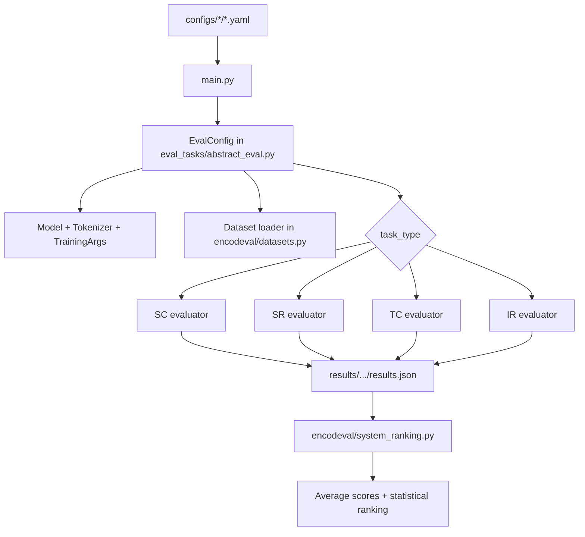

# EncodEval Repository Overview

This document explains how the repository is organized and how the main pieces connect.

> [!NOTE]
> This document was generate using Copilot

## High-level purpose

EncodEval is a framework to fine-tune and evaluate encoder models across four NLP task families:
- SC: Sequence Classification
- SR: Sequence Regression
- TC: Token Classification
- IR: Information Retrieval

It supports:
- Task-level evaluation runs from configuration files
- Per-example result export to JSON
- System-level aggregation and ranking across models

## Top-level layout

- `main.py`
  - CLI entrypoint.
  - Loads an evaluation config and dispatches to the matching evaluator class by task type.
  - Runs train/eval/predict depending on config flags.
  - Saves run output to results.json.

- `pyproject.toml`
  - Project metadata, package dependencies, and build backend.

- `README.md`
  - User-facing usage instructions and examples.

- `configs/`
  - Example task configuration files grouped by task type.
  - Includes sample training/evaluation settings and output paths.

- `encodeval/`
  - Core Python package.
  - Contains dataset loading utilities, task evaluators, ranking logic, and shared tools.

- `local/`
  - Local notebook workspace for experimentation.

- `results/`
  - Example results tree showing how outputs are structured across models, tasks, datasets, and hyperparameter settings.

## Core package structure: `encodeval/`

- `encodeval/datasets.py`
  - Dataset loading wrappers around Hugging Face datasets.
  - Supports optional local dataset override via `LOCAL_DATASET_DIR`.
  - Defines dataset constructors for many benchmark tasks.
  - Stores shared language and language-pair constants.

- `encodeval/eval_tasks/`
  - Evaluation pipeline classes.
  - Contains:
    - `abstract_eval.py`: shared `EvalConfig` and `AbstractEval` base.
    - `sequence_classification_eval.py`: SC pipeline.
    - `sequence_regression_eval.py`: SR pipeline.
    - `token_classification_eval.py`: TC pipeline.
    - `retrieval_eval.py`: IR pipeline.
    - `__init__.py`: task exports.

- `encodeval/system_ranking.py`
  - System-level analysis utilities.
  - Computes average scores across subsets/languages.
  - Performs pairwise statistical tests and ranking clusters.

- `encodeval/tools.py`
  - Small shared helpers (for example model summary and GPU cache cleanup).

## Evaluation flow

1. Run CLI
   - `main.py` is called with config_file and model_path.

2. Build config and evaluator
   - configue loads `eval_config` from the selected YAML.
   - `EvalConfig` initializes model, tokenizer, training args, dataset, and output directories.
   - Evaluator class is selected from `task_type` (SC, SR, TC, IR).

3. Train and evaluate
   - Optional training step (based on config).
   - Validation and/or test inference.
   - Temporary fine-tuned output directory may be cleaned after evaluation.

4. Persist results
   - Writes `results.json` to the configured results directory.

## Results directory convention

The repository uses a nested structure like:

```
results/
  toy/
    <model_name>/
      <task_type>/
        <dataset_name>/
          <hyperparam_setting>/
            results.json
```

Where:
- `task_type` is one of IR, SC, SR, TC.
- Multiple hyperparameter folders allow validation-based model selection.
- `system_ranking` utilities can aggregate this tree to compare systems.

## How configs and code map together

- `configs/*/*.yaml` choose:
  - task type
  - model/tokenizer classes and kwargs
  - trainer arguments
  - dataset loader function
  - output/result paths

- `encodeval/eval_tasks/*.py` implement task-specific preprocessing, trainer setup, metrics, and prediction formatting.

- `encodeval/system_ranking.py` is used after task runs to compare multiple models and produce statistically grounded rankings.

## Quick orientation checklist for new contributors

- Start with `README.md` for usage.
- Read `main.py` to understand runtime control flow.
- Read `encodeval/eval_tasks/abstract_eval.py` for shared lifecycle and output path logic.
- Open the task file matching your domain (SC, SR, TC, or IR).
- Use `results/toy` as a reference for expected output organization.

## Compact architecture diagram


[](https://mermaid.live/edit#pako:eNptU9tuozAQ_RXLj13KLTfKw0oppG3apitt81QTRV5wCBuwI9u0S6P8-w6mlNWq4uXMmXNmRjP4hFORMRziXSne0j2VGq3jhCM0J6nguyJXzoVzYTe0Kjfo8vI7uiYVLbh9bDat6tpwEVm80jIyelRwxCDaaqoOyqG_lJY01duW612RccVkBa1L9A2txYHx4p3JFksoX_B8LnP1j3hBYgoVmUaloBko2za8nR3qOlmXU32D2HgeW7gYYFfp5tROttXNkZ1b9sawt-Q5MnPXVAu5GRJ35Pnnl4klWX_tuCfL_x23JvFg1jSwdx3bwuUA7wf40M3e2wrBwdd9CD2a5IpIpupSK8e2becD27-VkSK0MqInMqxKNUqzaispP8CW-4U9Gd0PMn9lkuYMqVRALTiH0tBX6SKlJfrwGAO2cC6LDIda1szCFZPwW0CIT202wXrPKpbgEGDGdhSmSnDCz2A7Uv4iRNU7pajzPQ53tFQQ1Uc4JYsLmktafbKScTh5JGqucTgORqYIDk_4Dw5HE9f23Wngzab-9Goy8izc4BDIwPMnnjcej90rLzhb-N00BX42cV3Xc2f-NPBdb2JhlhVwklX3DsxzOP8FIOb4CQ)